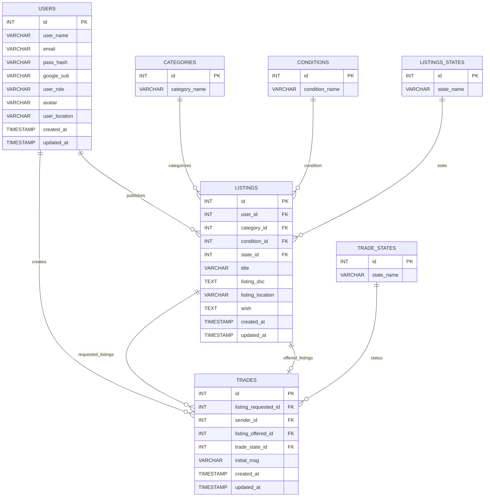
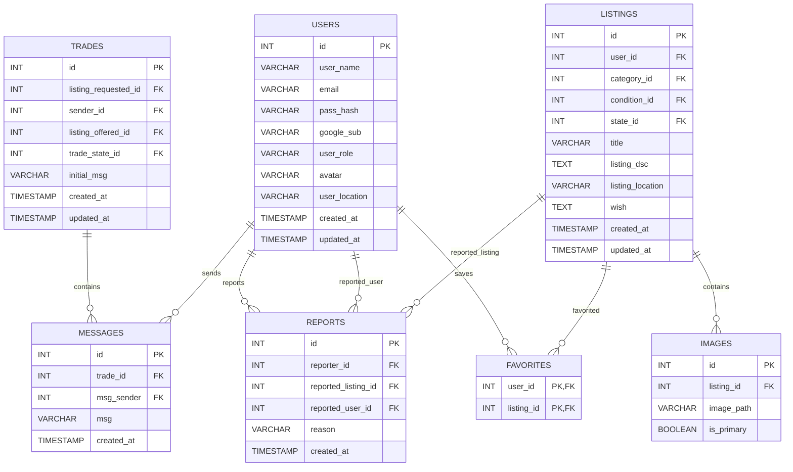

# DAKA - Entity-Relationship Model

## Entity Relationship Diagram - Core Data Model

```mermaid
erDiagram

    USERS {
        INT id PK
        VARCHAR user_name
        VARCHAR email
        VARCHAR pass_hash
        VARCHAR	google_sub
        VARCHAR user_role
        VARCHAR avatar
        VARCHAR user_location
        TIMESTAMP created_at
        TIMESTAMP updated_at
    }

    CATEGORIES {
        INT id PK
        VARCHAR category_name
    }

    CONDITIONS {
        INT id PK
        VARCHAR condition_name
    }

    LISTINGS_STATES {
        INT id PK
        VARCHAR state_name
    }

    TRADE_STATES {
        INT id PK
        VARCHAR state_name
    }

    LISTINGS {
        INT id PK
        INT user_id FK
        INT category_id FK
        INT condition_id FK
        INT state_id FK
        VARCHAR title
        TEXT listing_dsc
        VARCHAR listing_location
		TEXT wish
        TIMESTAMP created_at
        TIMESTAMP updated_at
    }

    TRADES {
        INT id PK
        INT listing_requested_id FK
        INT sender_id FK
        INT listing_offered_id FK
        INT trade_state_id FK
        VARCHAR initial_msg
        TIMESTAMP created_at
        TIMESTAMP updated_at
    }

    USERS ||--o{ LISTINGS : publishes
    CATEGORIES ||--o{ LISTINGS : categorizes
    CONDITIONS ||--o{ LISTINGS : condition
    LISTINGS_STATES ||--o{ LISTINGS : state

    USERS ||--o{ TRADES : creates
    LISTINGS ||--o{ TRADES : requested_listings
    LISTINGS ||--o| TRADES : offered_listings
    TRADE_STATES ||--o{ TRADES : status
```
 
 

## Entity Relationship Diagram - Support Data Model

```mermaid
erDiagram

    IMAGES {
        INT id PK
        INT listing_id FK
        VARCHAR image_path
        BOOLEAN is_primary
    }

    MESSAGES {
        INT id PK
        INT trade_id FK
        INT msg_sender FK
        VARCHAR msg
        TIMESTAMP created_at
    }

    REPORTS {
        INT id PK
        INT reporter_id FK
        INT reported_listing_id FK
        INT reported_user_id FK
        VARCHAR reason
        TIMESTAMP created_at
    }

    FAVORITES {
        INT user_id PK,FK
        INT listing_id PK,FK
    }

    USERS {
        INT id PK
        VARCHAR user_name
        VARCHAR email
        VARCHAR pass_hash
        VARCHAR	google_sub
        VARCHAR user_role
        VARCHAR avatar
        VARCHAR user_location
        TIMESTAMP created_at
        TIMESTAMP updated_at
    }

    LISTINGS {
        INT id PK
        INT user_id FK
        INT category_id FK
        INT condition_id FK
        INT state_id FK
        VARCHAR title
        TEXT listing_dsc
        VARCHAR listing_location
		TEXT wish
        TIMESTAMP created_at
        TIMESTAMP updated_at
    }

    TRADES {
        INT id PK
        INT listing_requested_id FK
        INT sender_id FK
        INT listing_offered_id FK
        INT trade_state_id FK
        VARCHAR initial_msg
        TIMESTAMP created_at
        TIMESTAMP updated_at
    }

    LISTINGS ||--o{ IMAGES : contains

    TRADES ||--o{ MESSAGES : contains
    USERS ||--o{ MESSAGES : sends

    USERS ||--o{ REPORTS : reports
    USERS ||--o{ REPORTS : reported_user
    LISTINGS ||--o{ REPORTS : reported_listing

    USERS ||--o{ FAVORITES : saves
    LISTINGS ||--o{ FAVORITES : favorited

```
